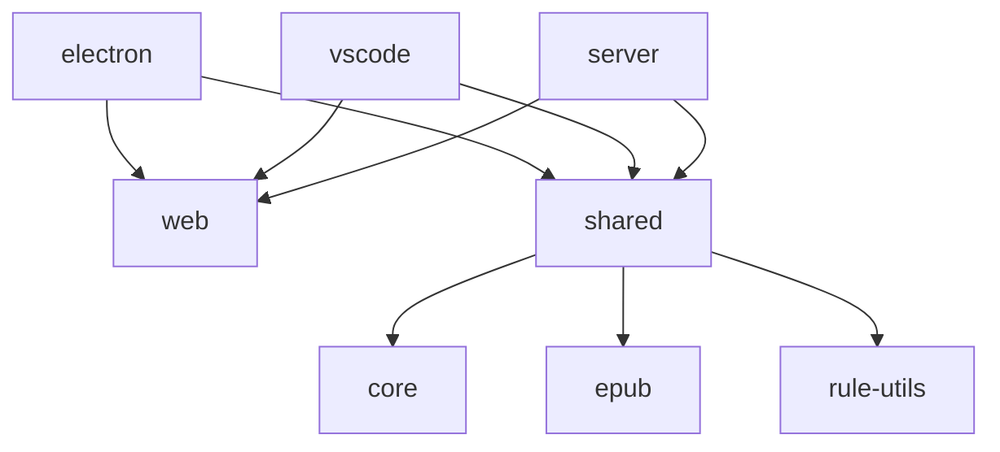

# README

## 源码目录结构

```
├── docs
├── packages
|  ├── cli                命令行工具
|  ├── core               规则解析库
|  ├── rule-utils         规则转换
|  ├── epub               epub解析
|  ├── shared             多端通用逻辑
|  ├── vscode             vscode插件
|  ├── utools             utools插件
|  ├── rubick             rubick插件
|  ├── server             web端需要的服务端
|  └── web                模板
├── README.md
└── scripts
```

## 模块调用关系



- `electron` 代码也在 `web` 里面
- `web` 包含了各端的前端模版代码
- `shared` 是主要的逻辑代码、与平台无关
- `core` 用于规则解析
- `rule-utils` 用于规则转换、创建等规则工具
- `epub` 用于 epub 书籍解析
- `electron` 前端使用 `ipc` 和 `shared` 通信
- `vscode` 前端使用 `postMessage` 和 `shared` 通信
- `网页端` 前端使用 `axios` 和 `shared` 通信
